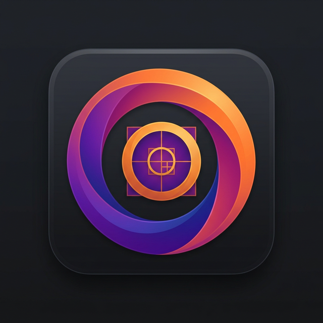

<div align="center">
  
  <h1>Fibo - Fibonacci Merge Game</h1>
  <p><strong>A sleek, minimalist, and deeply satisfying logic puzzle based on the Fibonacci sequence.</strong></p>

  [](https://reactnative.dev/)
  [](https://expo.dev/)
  [](https://www.typescriptlang.org/)
  [](https://jestjs.io/)
</div>

<br>

## 🎮 Oyunun Mantığı (How to Play)

Fibo, klasik 2048 tarzı kaydırma (swipe) tabanlı bir bulmaca oyunudur, ancak **çok önemli bir bükülme** içerir: Aynı sayıları birleştirmek yerine, **ardışık Fibonacci sayılarını** birleştirirsiniz!

### Fibonacci Dizisi Nedir?
Fibonacci dizisi, her sayının kendisinden önceki iki sayının toplamı olduğu bir sayı dizisidir:
`1, 1, 2, 3, 5, 8, 13, 21, 34, 55, 89, 144...`

### Kurallar
1. **Kaydır (Swipe):** Karoları tahta üzerinde hareket ettirmek için `Sol`, `Sağ`, `Yukarı` veya `Aşağı` kaydırın.
2. **Birleştir (Merge):** Yan yana duran ardışık iki Fibonacci sayısını birbiriyle çarpıştırarak onları birleştirin ve dizideki bir sonraki sayıya dönüştürün.
   - Örnek: `2` ve `3` yan yanaysa birleşip `5` olur. `(2 + 3 = 5)`
   - Örnek: `8` ve `13` birleşip `21` olur. `(8 + 13 = 21)`
   - **İstisna:** `1` karoları sadece başka bir `1` karosu ile birleşebilir `(1 + 1 = 2)`.
3. **Eşleşmeyenler:** Ardışık olmayan Fibonacci sayıları (örneğin `2` ve `5`) birleşemez!
4. **Hedef:** Tahta dolup hamle yapacak yer kalmayana kadar en yüksek puana, yani mümkün olan en büyük Fibonacci sayısına ulaşmaya çalışın.

---

## ✨ Özellikler

- **Zihin Açıcı Zorluk:** 2048'den farklı olarak, iki sayının birleşip birleşemeyeceğini sürekli olarak hesaplamanız (diziyi hatırlamanız) gerekir.
- **Pürüzsüz Animasyonlar:** Tamamen `react-native-reanimated` ile native hızında 60FPS çalışan birleşme, kayma ve belirmese animasyonları.
- **Dokunsal Geri Bildirim:** Hareketlerde, başarılı birleşmelerde ve rekor kırmada `expo-haptics` destekli tatmin edici titreşimler.
- **Modern UI:** Estetik tipografi (Inter) ve renk paleti içeren modern, Flat ve temiz arayüz.
- **Performans & Stabilite:** Güçlü `useReducer` mimarisiyle state yönetimi ve sıfır memory leak/stale closure riski.
- **Test Edilmiş Temel Mantık:** Oyunun tüm algoritmik kalbi tamamen Jest (100% test coverage) ile korunuyor.

---

## 🛠️ Teknoloji Yığını (Tech Stack)

Fibo tamamen modern mobil geliştirme standartlarına uygun olarak inşa edilmiştir:

- **Framework:** React Native + Expo SDK 54
- **Core Language:** TypeScript (Strict Mode)
- **Routing:** Expo Router
- **State Management:** React `useReducer` pattern
- **Gestures & Animations:** `react-native-gesture-handler` & `react-native-reanimated`
- **Testing:** `ts-jest`
- **Data Persistence:** `@react-native-async-storage/async-storage`

---

## 🚀 Kurulum (Local Development)

Projeyi kendi ortamında çalıştırmak için aşağıdaki adımları izleyebilirsin:

### Geresinimler
- Node.js (v18+)
- Npm veya Yarn
- Expo Go App (iOS / Android)

### Adımlar

1. Depoyu klonlayın:
   ```bash
   git clone https://github.com/fth530/fibo.git
   cd fibo
   ```

2. Bağımlılıkları yükleyin:
   ```bash
   npm install
   ```

3. Geliştirme sunucusunu başlatın:
   ```bash
   npx expo start --clear
   ```

4. Telefonunuzdaki **Expo Go** uygulaması ile QR kodunu okutup oynamaya başlayın!

---

## 🧪 Test Çalıştırma

Oyunun temel (core) logici ve state geçişleri Jest testleri ile kapsanmıştır:

Tüm testleri bir defa çalıştırmak için:
```bash
npm test
```

Testleri izleme (watch) modunda çalıştırmak için:
```bash
npm run test:watch
```

---

<div align="center">
  <p>Engineered with 💡 & ☕</p>
</div>
